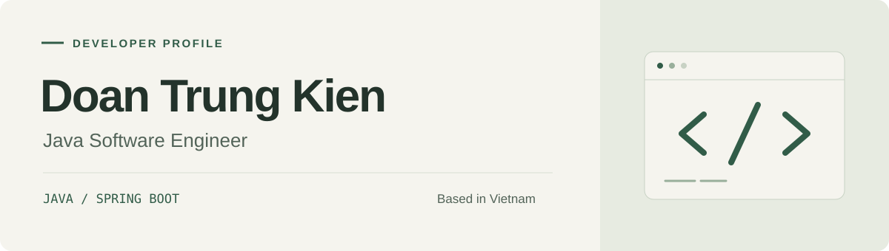
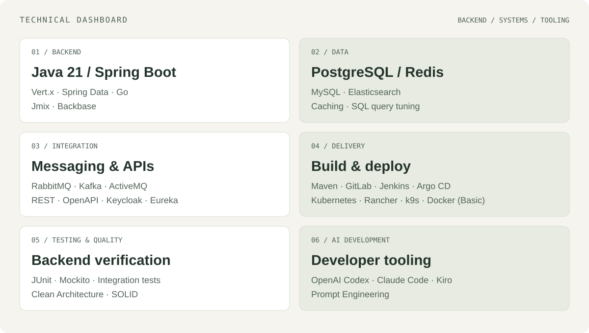

  <a href="#introduction">Introduction</a> &nbsp; / &nbsp;
  <a href="#tech-stack">Tech stack</a> &nbsp; / &nbsp;
  <a href="#github-dashboard">GitHub dashboard</a> &nbsp; / &nbsp;
  <a href="#connect">Connect</a>

## Introduction

I'm **Doan Trung Kien**, a **Java Backend Engineer** based in Vietnam. I develop backend services with **Java 21, Spring Boot, and Vert.x**, integrate REST APIs, and build asynchronous workflows with RabbitMQ.

I enjoy improving service performance through Redis caching and SQL query tuning. My technical interests include distributed systems, event-driven architecture, and cloud-native technologies.

[Explore my repositories](https://github.com/dtkien-dev?tab=repositories) · [Connect on LinkedIn](https://www.linkedin.com/in/doantrungkien10082002/)

## Tech stack

| Area | Technologies & tools |
| :--- | :--- |
| **Languages** | Java 21 · Go |
| **Backend & frameworks** | Spring Boot · Spring Data · Vert.x · Jmix · Backbase |
| **APIs & identity** | REST APIs · OpenAPI · Keycloak |
| **Data & caching** | PostgreSQL · MySQL · Redis · Elasticsearch |
| **Messaging & discovery** | RabbitMQ · Apache Kafka · ActiveMQ · Eureka |
| **Build & delivery** | Maven · Git · GitLab · GitFlow · Jenkins · Argo CD |
| **Containers & operations** | Kubernetes · Rancher · k9s · Docker (Basic) |
| **Observability & engineering insights** | Grafana · LinearB |
| **AI-assisted development** | OpenAI Codex · Claude Code · Kiro · Prompt Engineering |

**Engineering practices:** Clean Architecture, SOLID principles, asynchronous processing, caching strategies, SQL pagination and query tuning, production troubleshooting, and log analysis.

## GitHub dashboard

A view of my public GitHub activity. These cards are generated by external services and may update at different times.

### Contributions & activity

<picture>
  <source media="(prefers-color-scheme: dark)" srcset="https://github-profile-summary-cards.vercel.app/api/cards/profile-details?username=dtkien-dev&amp;theme=github_dark">
  
</picture>

### Repository statistics

<picture>
  <source media="(prefers-color-scheme: dark)" srcset="https://github-readme-stats.vercel.app/api?username=dtkien-dev&amp;show_icons=true&amp;hide_rank=true&amp;hide_border=true&amp;theme=dark&amp;title_color=8FBC9B&amp;icon_color=8FBC9B">
  
</picture>

[View activity on GitHub](https://github.com/dtkien-dev?tab=overview) · [Explore repositories](https://github.com/dtkien-dev?tab=repositories)

## Connect

Open to collaboration, project discussions, and exchanging technical ideas.

**[LinkedIn](https://www.linkedin.com/in/doantrungkien10082002/)** &nbsp; / &nbsp; **[GitHub](https://github.com/dtkien-dev)** &nbsp; / &nbsp; **[Email](mailto:doantrungkien10082002@gmail.com)**
